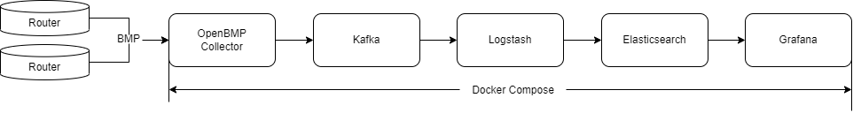

# BGP Monitoring Protocol Playground
このレポジトリではBGP Monitoring Protocolのサーバ側で必要となるツール一式の設定情報などをまとめています。

実際にdocker composeによって以下のツールを使用したBMPの収集環境を立ち上げることができます。
- OpenBMP Collector ... BMPメッセージの受信とパース
- Kafka ... OpenBMP Collectorからの出力を受けるためのメッセージキュー
- Logstash ... KafkaからBMPメッセージを取得して整形しElasticsearchへ
- Elasticsearch ... BMPメッセージの保存と検索
- Grafana ... グラフなどの可視化機能の提供


 
# 使い方

## BMPサーバとして使用する場合

0. ルータにBMPの設定を入れる

このレポジトリではBMPサーバは1790/tcpを使用するように設定されています。
ルータ側でもそれに合わせたBMPやファイアウォールの設定を行ってください。
異なるポートを使用したい場合はdocker-compose.yaml内のopenbmpに関する設定を変更してください。

1. このレポジトリをクローンする

```
git clone https://github.com/MutoShota/bmp-playground
```

2. クローンしたディレクトリに移動してdocker composeで各コンテナを立ち上げる

```
cd bmp-playground
sudo docker compose up -d
```

3. Grafanaのダッシュボードを見る

GrafanaではBMP用のダッシュボードを見ることができます。デフォルトでは3000番ポートで受け付けています。
IPアドレスの部分は実際のホストのIPアドレスに置き換えてください。

```
http://{ホストのIPアドレス}:3000
```