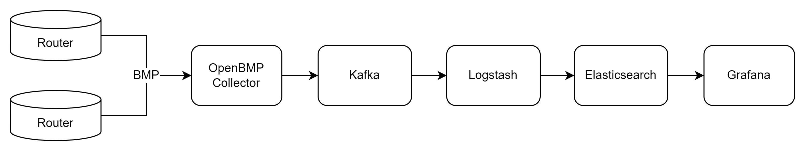

# BGP Monitoring Protocol Playground
このレポジトリではOpenBMP Collectorを使用したBMP収集環境の設定例をまとめています。

実際にdocker composeによって以下のようなBMPの収集環境を立ち上げることができます。

デフォルト設定
- OpenBMP Collector
    - 受信ポート: 1790
- Grafana
    - 受信ポート: 3000 
    - ログイン情報: admin/bmp

# 使い方
Docker Composeですべてのツールが立ち上がるようになっています。ツール類の設定ファイルは`servers`配下に格納されています。
